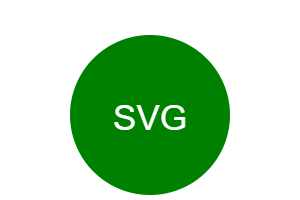
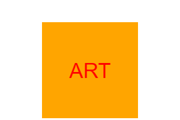
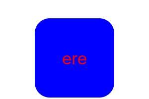
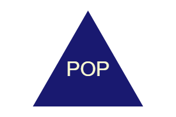
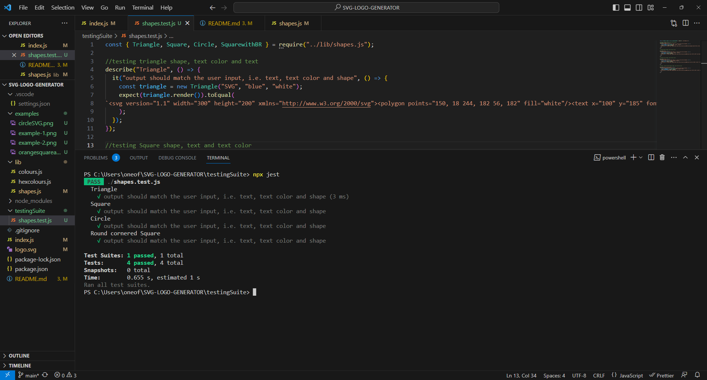

# SVG-LOGO-GENERATOR

## Table of Contents

- [Description](#description)
- [Installation](#installation)
- [Usage](#usage)
- [Tests](#tests)
- [Credits](#credits)
- [License](#license)

## Description

User Story:
As a freelance web developer I want to generate a simple logo for my projects so that I don't have to pay a graphic designer.

The given user story perfectly describes this project. This project is a command line application that allows users to input their logo label, gives options to select shape and colors for the logo they wish to create.

## Installation

Prerequisites

Before you begin, please make sure you have the following software and tools installed on your system:

Node.js and npm (Node Package Manager): You can download and install the 16th version of Node.js:

[the official website](https://nodejs.org/en/blog/release/v16.16.0)

Clone the Repository either from:

[GitHub Repo](https://github.com/hafsah1976/SVG-LOGO-GENERATOR)

The Command line/Git Bash: Open a terminal or command prompt. Navigate to the directory where you want to clone the project using cd command. Run the following command to clone the repository:

gh repo clone hafsah1976/SVG-LOGO-GENERATOR

Navigate to Project Directory using cd SVG-LOGO-GENERATOR

Run the following command to install the required project dependencies using npm:

npm install

After the installation is complete, you can start the SVG Logo Maker application by running:

node index.js

This will start the application, and you'll be prompted to provide inputs for creating a logo.

Follow the application prompts provided by the application to enter logo details, such as characters, colors, and shapes. After completing the prompts, the application will generate an SVG logo file named logo.svg in the project directory.

## Usage

### Walkthrough Video

Here is a link to a walkthrough video of the logo being generated and running a testing suite:

[Walkthrough Video](https://watch.screencastify.com/v/cRxwOSAOD9cLjGuDIp7e)

## Tests

[1]. Making a green Circle that have white characters "SVG"

[2].Making an orange Square that has the characters "ART" in red color

[3].Making a Blue Square with Border Radius that has the characters "ere" in red color

[4]. Making a Triangle using hexadecimal code from hexcolours array in the lib folder, it has the characters "POP"

[5]. Testing shapes.test.js by running the command npx jest

## Credits

Certainly! Here are the provided links in Markdown format:

- [CSS Color Names](https://www.dofactory.com/css/color-names)

- [Node.js Interactive Command Line Prompts](https://www.digitalocean.com/community/tutorials/nodejs-interactive-command-line-prompts)

- [SVG Polygon Element](https://developer.mozilla.org/en-US/docs/Web/SVG/Element/polygon)

- [SVG Circle Element](https://developer.mozilla.org/en-US/docs/Web/SVG/Element/circle#attributes)

- [SVG Tutorial: Getting Started](https://developer.mozilla.org/en-US/docs/Web/SVG/Tutorial/Getting_Started)

- [SVG Tutorial: Basic Shapes](https://developer.mozilla.org/en-US/docs/Web/SVG/Tutorial/Basic_Shapes)

- [SVG Tutorial: Texts](https://developer.mozilla.org/en-US/docs/Web/SVG/Tutorial/Texts)

- [SVG Element `<g>`](https://developer.mozilla.org/en-US/docs/Web/SVG/Element/g)

## License

Copyright (c) 2023 hafsah1976

Permission is hereby granted, free of charge, to any person obtaining a copy
of this software and associated documentation files (the "Software"), to deal
in the Software without restriction, including without limitation the rights
to use, copy, modify, merge, publish, distribute, sublicense, and/or sell
copies of the Software, and to permit persons to whom the Software is
furnished to do so, subject to the following conditions:

The above copyright notice and this permission notice shall be included in all
copies or substantial portions of the Software.

THE SOFTWARE IS PROVIDED "AS IS", WITHOUT WARRANTY OF ANY KIND, EXPRESS OR
IMPLIED, INCLUDING BUT NOT LIMITED TO THE WARRANTIES OF MERCHANTABILITY,
FITNESS FOR A PARTICULAR PURPOSE AND NONINFRINGEMENT. IN NO EVENT SHALL THE
AUTHORS OR COPYRIGHT HOLDERS BE LIABLE FOR ANY CLAIM, DAMAGES OR OTHER
LIABILITY, WHETHER IN AN ACTION OF CONTRACT, TORT OR OTHERWISE, ARISING FROM,
OUT OF OR IN CONNECTION WITH THE SOFTWARE OR THE USE OR OTHER DEALINGS IN THE
SOFTWARE.
